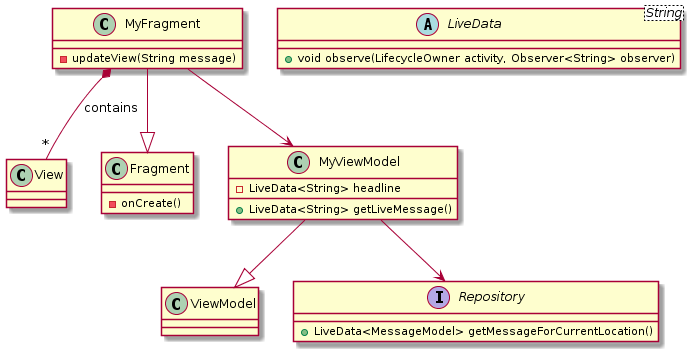

# Local Campus App - Description of the Application

The initial goal of the application was to provide a local version of the
campus communication app [Jodel](https://jodel.com/), extended by additional
ways to interact with the environment (e.g. the cafeteria or the thermostat of
a room). In order to support various ways to interact with the environment,
instead of creating an application with a fixed number of interactions, we
created the application to support *Extensions* created by the users that are
shared over the network. Instead of limited text and image posts as they exist
in Jodel, the feeds in our application consist of *Posts* that allow the user
to interact with the environment in various ways. The communication channels,
which are called *Topics* in our application, are tiered to the location, and
interaction is only possible with Topics that are relevant to the users
location.

# System Architecture

Our system consists of Android devices with our application installed acting
as the users interface with our system and Raspberry Pi's acting as *Hubs* for
a specific location. They communicate over SCAMPI, which is a Delay Tolerant
Opportunistic Networking Middleware. For SCAMPI to work, each device has to
run the SCAMPI Router application. SCAMPI allows the devices to store and
carry messages with them and therefore share them with multiple Hubs. This is
important as some messages are relevant for the whole campus and therefore
need to be transferred between multiple Hubs/rooms. In our architecture, there
SHOULD be one Hub for every distinct location, e.g. a lecture hall or the
cafeteria. The Android devices don't communicate directly, instead, they only
interact with the Hubs. The Hubs also aren't connected in any way, they only
receive messages from the clients interacting with them.

In a first, basic version of the application, the Hubs act as wireless access
points that have the SCAMPI Router application running on a well-known IP and
port. When available, they also share their wired ethernet connection with the
devices connected to the wireless network. In a future version of the
application, the Hubs could be connected to the campus network, which would
allow the client devices could stay connected to the more powerful campus
network. The Hubs would then need to be identified and connected to using an
alternative method. One solution would be to broadcast an IP address over
Bluetooth beacons, which the SCAMPI Router application would then connect to.
Even if this additional method to connect to a Hub is added, the basic
connectivity method should remain, as the application can be deployed
independently of the existing infrastructure.

# Entities / Message Types

Our application has multiple important entities.

## Topic 

The most general entity is a Topic, which defines a channel of communication,
e.g. `/tum` or `/tum/garching`. While there is a structure to this Topic
names, the system treats them independently of each other (the logic for
tiering could be added to the application layer. As each of them represents a
SCAMPI Service, and those services don't support any tiering. Topics are
shared over the `discovery` service, which is populated by a special
publishing application running on every Hub. They MUST not be shared by the
Android devices, they should only come directly from the Hub the client is
connected to. The Topic messages contain a field `deviceId`, which
identifies the location the Topic was broadcasted at. As the App will receive
the location identifier of the Hub it is connected to using SCAMPI's location
update service, this allows the App to identify all Topics relevant to the
current location.

```
String: topicName // e.g /tum or /tum/garching
String :deviceId // Identifier of the device (location)
```
Topic Message on the `discovery` service

## Post

The most important entity in our system is a *Post*. It corresponds to one
root message and is published to one Topic. It contains meta information like
the creation date and the id of the creator and the data, which is sent as a
string and parsed depending on the *PostType*. The data MUST be encoded as
JSON and contain the two mandatory fields `text` and `color`, which are used
to display the list of Posts. The rest of the data is defined by the PostType
and can therefore only be parsed by the extension responsible for this PostType.

```
String: message_type = post
String: topic // e.g. /tum
String: uuid
String: creator
Integer: created_at // timestamp
String: data // encoded as json, needs the to contain the fields "text" and "color"
String: type_id // PostRype, identifing the Extension required to show this post (UUID)
```
Post message on a Topic service

## Vote

There is a score attached to every Post, which is defined by the users rating
the Post either positively or negatively, and the Posts are sorted depending
on this score. This score is calculated from the *Votes*, another entity in
the system. Each Vote is transferred as it's own message. The Votes are sent
to the same Topic service as the post they belong to.

```
String: message_type = vote
String: uuid
String: post_uuid
String: creator
Integer: created_at
Integer: score_influence
```
Vote message on a Topic service

## Post Extension

There can be multiple *PostExtensions* attached to a Post, which
contain similar fields to the Post itself and are only parsed by the
extension responsible for the Posts PostType. A PostExtension could, for
example, be a comment attached to a text post, which allows interaction
similar to the one provided by Jodel. The PostExtensions are spread over
the same service as the Posts and Votes.

```
String: message_type = post_extension
String: uuid
String: post_uuid
String: creator
Integer: created_at
String: data // encoded as JSON, no required fields
```
PostExtension message on a Topic service

## Extension 

The Extensions, which are needed to show PostTypes that are not included in
the application, need to be shared between devices. This happens over simple
messages containing the extension apk file and the Extensions UUID. If an
extension needs to be updated, one has to publish it with a new UUID. The
application will therefore treat it as a new Extension and is able to handle
posts from both versions. The Extensions are shared over a special
`extensions` service.

```
String: message_type = extension
String: uuid
Binary: binary
```
PostExtension message on the `extensions` service

## General remark around the Entities

While at first we planned to update the Posts to include new PostExtensions
and Votes and merge them if there were concurrent changes, which would lead to
a situation where the always is only one self-stabilizing message per Post in
the system, we decided to use separate messages for Votes and PostExtensions
to reduce the network overhead. Furthermore, updating messages on remote nodes
is not supported by the communication framework, therefore the outdated
messages would remain on the remote systems. Finally, in order to be able to
merge posts, they would need to be designed in a special way (e.g. no hard
deletes), which would lead to complex messages.

In order to support post types that contain complex binary data, another
entity type *BinaryPost* could be added to the system. This type should be
similar to the regular Post entity but contains an additional binary field
that can be used to e.g. transfer an image. As this has different requirements
to the device (e.g. storage permissions/storage space) and we want to prevent
backward compatibility issues, this should be treated as a new entity instead
of updating the existing entity. To allow devices to be able to decide whether
they want to receive binary Posts, they also have to be sent to an additional
topic service.

# Android Application Architecture

For our Android App, we decided to extensively use [Android Jetpack Components](https://developer.android.com/jetpack/).
Jetpack is a state of the art set of components, tools, and guidance to create
Apps with modern Android features. Jetpack components are  self-contained
libraries, so they don’t necessarily have to be combined with other Jetpack
components.

We used the following Jetpack components frequently:
- ViewModel
- LiveData

We decided not to use the Jetpack-Navigation component (which is the
recommended way to do navigation within the App) because it doesn't fit our
use-case of dynamically loaded extensions to show different PostTypes. The
Navigation library transitions between multiple Fragments that need to be
defined at compile time and are hosted by a single Activity. As it is
impossible to reference the Fragments of dynamically loaded extensions at
compile time, the Fragments to add or show Posts would need to be nested
within another Fragment that is known at compile time. This would lead to an
additional layer of nesting compared to our approach, in which every view of the
App is an Activity and some of those Activities host dynamically loaded
Fragments.

The Android application is structured in a way that every Post, PostExtension
and Vote shown in the UI has been received over the network, even the ones
created by the App itself, which leads to a reproducible data flow. The
application is encapsulated from the networking and data layer by an
repository layer, which ensures that this dataflow is respected. Furthermore,
the repository layer with it's well-defined interface allows easy replacement
of the actual data implementation with a local, in-memory variant for faster
application logic and UI development.

The UML diagram shown in figure 1 describes the components of our application
frontend and how they interact with each other.



`MyFragment`, which is an Android Fragment, contains some Android UI
components (e.g. a TextView to show a message), which are updated by calling
the method `updateView(String message)`. In order to encapsulate the data
processing logic (e.g. extracting a message from the Model) from the Fragment,
our system is designed according to the MVVM pattern. In this pattern, the
Fragments, which represent the Views (V) in the Pattern, only show the data
(`message`) without having knowledge about how the Model (M) needs to be
processed. The processing is done by the ViewModel (VM), which transforms the
Models into the form in which it is shown in within the View (In the Example,
this step would be extracting the Message text from the `MessageModel`). The
ViewModel fetches this Model data from the repository layer. Because all
processing (e.g. parsing JSON data, transformations of LiveData, error
handling etc.) is done in the ViewModel, it can be tested without any slow GUI
tests or Android instrumented unit tests. This promotes testing of the
frontend of the App.

The frontend uses [LiveData](https://developer.android.com/topic/libraries/a
rchitecture/livedata), which is an observable data holder. LiveData lets the
components of an App observe LiveData objects for changes to the contained
Data, and therefore use updated data without manually polling it. One benefit
of LiveData compared to other reactive frameworks is its lifecycle-awareness.
The LiveData objects respect the lifecycle state of the App’s components
observing them (Activities, Fragments). This ensures that the observers only
receive data updates when they are in an active lifecycle state. In the
example from the diagram application, the ViewModel returns LiveData
containing the message. `MyFragment` observes this LiveData and calls its
`updateView(String message)` method if the data is changed.

In the real implementation of the networking and data layer, there is an
Android Service connected to the SCAMPI Router application via the AppLib
library. The SCAMPI router is, in turn, connected the network. This
AndroidService is responsible for the whole communication with the SCAMPI
network. On startup, it subscribes to messages sent to the `discovery` service
and, after receiving Topics relevant to the location, it dynamically
subscribes to the services defined by these Topics in order to receive Posts,
PostExtensions, and Votes. The Android service is also responsible for
publishing messages to the network. To do this, the repositories binds to it,
and calls methods provided by this binding, which then publish the messages to
the network. Only after they have been received again, they will be inserted
into the database and therefore shown in the UI. The database is an SQLite
database queried and managed by the [Room ORM library](https://developer.android.com/topic/libraries/architecture/room).
Room already returns LiveData that will be transformed in the repositories and
View Models.


Figure 2 shows a simplified diagram of the components involved in interacting
with a Post. The method `getPostsforTopic(long topicId)` in the PostRepository
directly reads the data (as LiveData) from the Database. If the UI layer wants
to add a new Post using the `addPost(Post post)` method of the PostRepository,
the repository will call the SCAMPIPostSerializer (not shown in the Figure) to
serialize the message into a SCAMPIMessage, and publish that to the network
using it's binding to the AppLibService. As explained before, the
AppLibService subscribes to all Topics relevant to the location. To do this,
it attaches a TopicHandler to the Topics service. If this Handler determines
that a received message contains a Post, it deserializes it using the
SCAMPIPostSerializer (not shown in the Figure) and calls the insert method of
the NetworkLayerPostRepository. This Repository handles duplicate inserts,
manages the relations and inserts the Post into the database using the Room
DAOs. It ensures that the Topic that the Post belongs to exists and links any
related PostExtensions and Votes that were received before the Post to the
Post, which ensures fast read access. As the data is inserted into the
Database, the Database will trigger LiveData updates. If the UI is
observing the Posts for a Topic, it will receive an update.

If the Android App has permissions to access local data, it will share the
Extensions needed to show certain PostTypes over the network. The data and
network layer by design don't know anything about the data contained in Posts
and PostExtensions, which allows quick modifications to the upper layers of
the application without changing these lower layers.

# Extension System

To allow various PostTypes without the need to modify the main application,
the application has a built-in extension system. These Extensions allow to
display and create Posts and their corresponding PostExtensions. They are
dynamically loaded at runtime when the user interacts with a Posts referencing
their extension UUID as its post type. If the extension is updated, it needs
to be given a new UUID, which allows multiple versions of one extension to
coexist.

Extensions are stripped-down Android Applications, as those already contain
the `.dex` File needed by the Android runtime to load code. Furthermore, the
extension needs to integrate the `localcampuslib` Android library, as it
provides the interface to interact with the host application. An extension at
least needs to provide one Android Fragment responsible for creating and one
Fragment responsible for showing Posts. These Fragments need to be registered
as static fields in a `Registry` class in the package
`de.tum.localcampusextension`. This `Registry` furthermore needs to contain
the extensions UUID and a description of the extensions as static fields.

The Fragment to show a Post, which needs to extend the `ShowPostFragment`
class provided by the localcampuslib, is instantiated and displayed by the
`ShowPostActivity` depending on the Posts PostType. The ShowPostActivity
provides the Fragment with a modified Android Context, which contains the
assets and resources defined in the apk file (it only supports the assets
defined by the extension, the extension has no access on the host
applications' resources. Furthermore, the Activity provides the Fragment with
a `ShowPostDataProvider`, which allows the Fragment to access the Post and
it's PostExtensions, create Votes and add additional PostExtensions. The
DataProvider also allows the extension to access the current userId to prevent
the user from creating duplicate PostExtensions. As this is only a local safety
measure (you cannot control the network), extensions also need to take care of
unwanted duplicate PostExtensions when reading them from the DataProvider. For
example, a voting application should only use the latest vote of a user. In
that case, duplicate Votes could still exist in the network and the database,
they are just ignored by the PostExtension.

The fragment to create a Post, which needs to extend the `AddPostFragment`
class provided by the localcampuslib, is instantiated by the
`CreatePostActivity` depending on the PostType selected before. The Activity
provides a Content modified in the same way as it is for the
`ShowPostFragment`. Furthermore, it provides an `AddPostDataProvider`, which
allows the Fragment to create a Post for the selected Topic and PostType.

As the Context contains the resources from the extensions .apk file,
developing the extension should be similar to developing a regular Android
Fragment, with the exception that XML resources currently cannot access or
reference other resources or classes provided by external packages.
Furthermore, the LayoutInflater passed to `onCreateView` cannot be used
directly, instead it needs to be patched like this:

```java
LayoutInflater newInflator = inflater.cloneInContext(getContext());
```

The components described above can also be found in the diagram shown in
figure 3.


The extension system currently has multiple security problems, which need to
be solved before actually using the application. The extension system loads
Java code that is directly executed in the process of the host application.
Therefore, the extension can do anything that is possible for code residing in
the host application. Furthermore, the extension apks are stored on the
external storage of the device. While this allows to add new extensions using
ADB, the extensions could be replaced with malicious code by other
applications. To solve this, the App needs to provide a way to verify the
integrity of extensions. As an example, the App could only load extensions
that are signed by authors that have been explicitly trusted by the user. If
this is not enough, the extension system could be modified to use sandboxed
webviews instead of Android Fragments.
